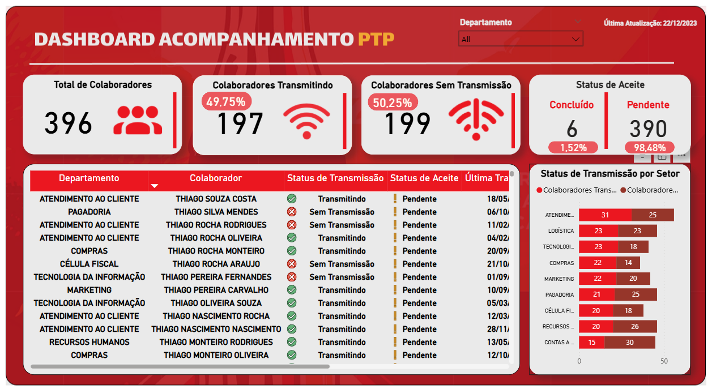

# Fhinck Tracking Dashboard - Power BI

This dashboard was developed to monitor the rollout and adoption of the Fhinck software across corporate workstations. The project was built for the second-largest Coca-Cola bottler in Brazil.

The business challenge was to manage the installation and daily operation of this software across a base of over 900 employees. The dashboard provided IT and Management teams with clear visibility into the deployment progress, allowing them to identify bottlenecks by department and act quickly on activation errors.

> **Disclaimer regarding Data Privacy (LGPD/GDPR):** 
> To comply with data protection laws and Non-Disclosure Agreements (NDA), **all data within this repository is 100% fictional**. The original dataset was completely replaced with dummy data. No real information about the company or its employees is exposed.

## Key Metrics and Views (KPIs)
The dashboard was designed to answer quick business questions, tracking:
- **Activation Status:** Volume of employees with active vs. pending software installations.
- **Transmission Tracking:** Monitoring the last data transmission date for each workstation.
- **Activation Mapping:** Total pending activation requests and system error categorization.
- **Department View:** Ranking of business units with the highest activation backlogs, enabling targeted IT support and ticket resolution.

## Repository Structure
- `Fhinck_Tracking_Dashboard.pbix`: The Power BI file containing the data model, relationships, and visualizations (using dummy data).
- `Data Dictionary.xlsx`: Technical documentation containing all Calculated Columns and Measures used in this project, alongside their respective DAX formulas and business rules.

## Tech Stack
- **Power BI:** ETL (Power Query), Data Modeling, Data Visualization.
- **DAX:** Time intelligence measures, conditional counts, and iterators.
- **Excel:** Data dictionary and technical documentation.

## Dashboard Preview
Below is a preview of the main dashboard page:

